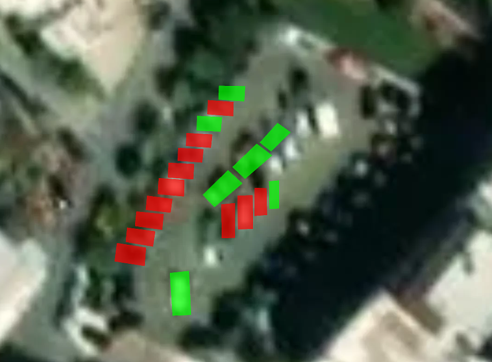
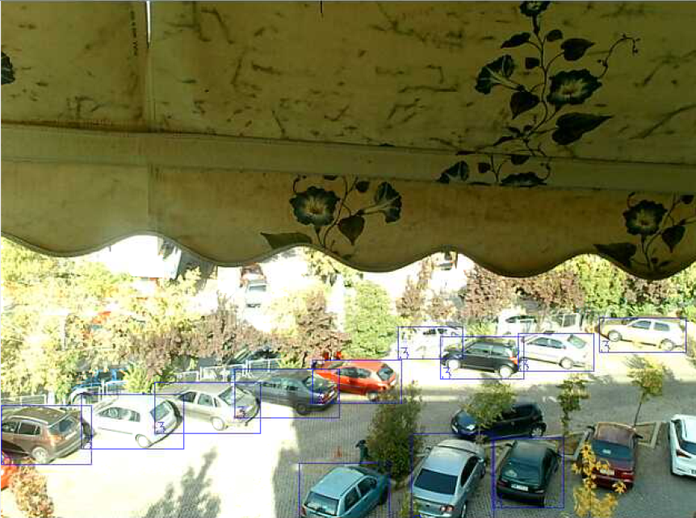
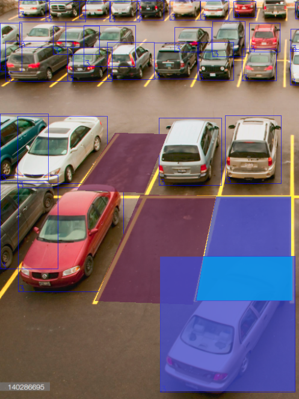
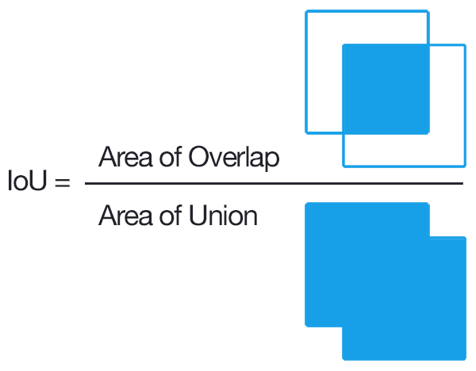
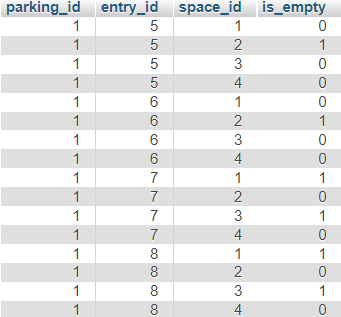
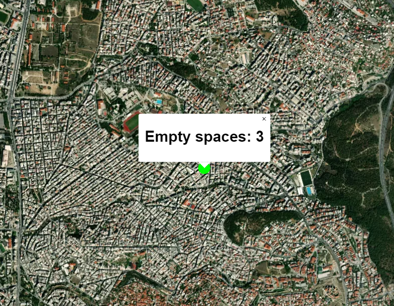

# Parking Detection
## Overview
A system that can be used to automatically detect the available parking spaces in a local parking lot. 
This system is currently in use by the municipality I live in, installed in a local parking lot: [Municipality Website](https://www.dimosneapolis-sykeon.gr/%CE%B5%CE%BD%CE%B7%CE%BC%CE%B5%CF%81%CF%89%CF%83%CE%B7/%CE%BD%CE%B5%CE%B1/3001/%CF%80%CE%B9%CE%BB%CE%BF%CF%84%CE%B9%CE%BA%CE%B7-%CE%B5%CF%86%CE%B1%CF%81%CE%BC%CE%BF%CE%B3%CE%B7-%CE%B4%CF%89%CF%81%CE%B5%CE%B1%CE%BD-%CF%80%CE%B1%CF%81%CE%B1%CE%BA%CE%BF%CE%BB%CE%BF%CF%85%CE%B8%CE%B7%CF%83%CE%B7-%CE%B5%CE%BB%CE%B5%CF%85%CE%B8%CE%B5%CF%81%CF%89%CE%BD-%CE%B8%CE%B5%CF%83%CE%B5%CF%89%CE%BD-%CF%83%CF%84%CE%B1%CE%B8%CE%BC%CE%B5%CF%85%CF%83%CE%B7%CF%82-free-parking-app), [System Website](http://pliamprojects.000webhostapp.com/parking/)

## Hardware
Actually, there are only two components in the system:
* Raspberry Pi 4B
* Camera (connected to the Raspberry)

These two are installed on a building next to the parking lot, so that the camera sees most of it, and an almost unobstructed view of the cars. 

## Machine Learning
The first step of the system is detecting all the cars visible in the image, something which requires a Machine Learning (AI) model. The most important factor for choosing a model was the accuracy, as long as the time was at most ~1min. 
After checking the [YOLOv5](https://github.com/ultralytics/yolov5) model (which was very fast but inaccurate) and the [Mask-RCNN](https://github.com/matterport/Mask_RCNN) model (which was very accurate but takes at least a minute for inference), I concluded that the latter was a better option.

## Parking Spaces
The next step is selecting the parking spaces in the image itself and saving it to a pickle file. 
After that, the detection script checks each parking space with each car and finds the IoU (Intersection over Union) of each pair. Then, It finds the maximum IoU for each parking space, and if it exceeds a specific thresold it is considered taken.

[Code (detection and availability check)](Detection%20System/detector_box.py)

    
   

 

## Automations

I have added a text (on the top right) on the website that informs the citizens about the last time the data were updated.

I have also made a php script that runs every 10 minutes and sends an email to me and the municipality IT Manager if the system has not sent data in the last 10 minutes, so that I access it remotely and restart it.

[Script code](Website/upd_notif.php)

The detection script is also being run at startup (with `crontab`), as well as in a loop (using a `watch` command), so that when it stops it is run again automatically.

## Database

The availability data are then encoded to JSON and sent to an online database via some [PHP files](Website/upload_data.php).

## Website ([Link](http://pliamprojects.000webhostapp.com/parking/))
The website consists of a map that:
* Either shows each parking lot (and its status, using a red or green rectangle) individually, if the map is sufficiently zoomed in
* Or shows a marker for each parking lot that contains information about the number of available parking spaces (if there is any, which is shown with the color of the marker

[Website Code](Website/index.php)

    
   

